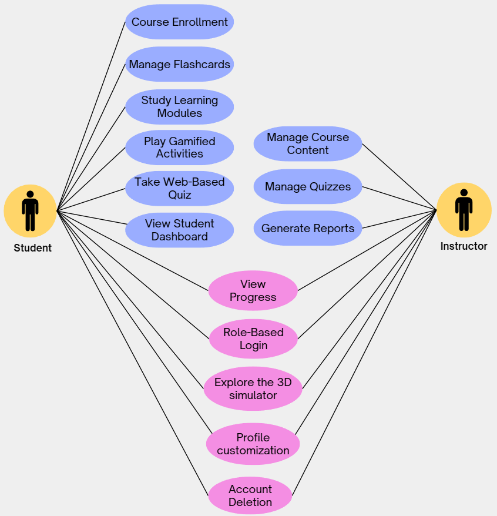
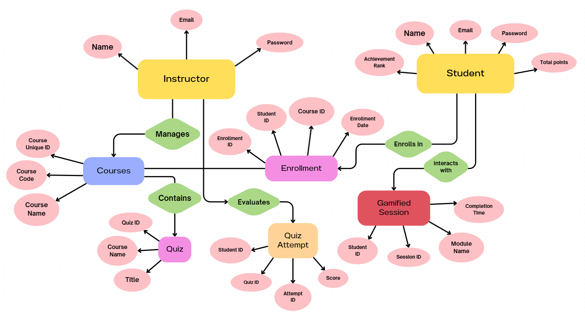
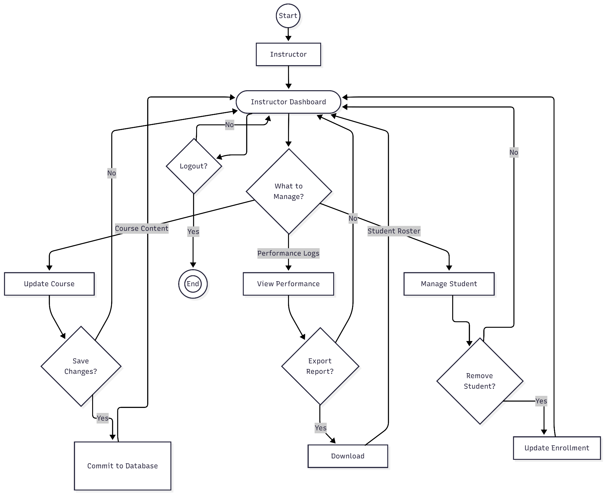
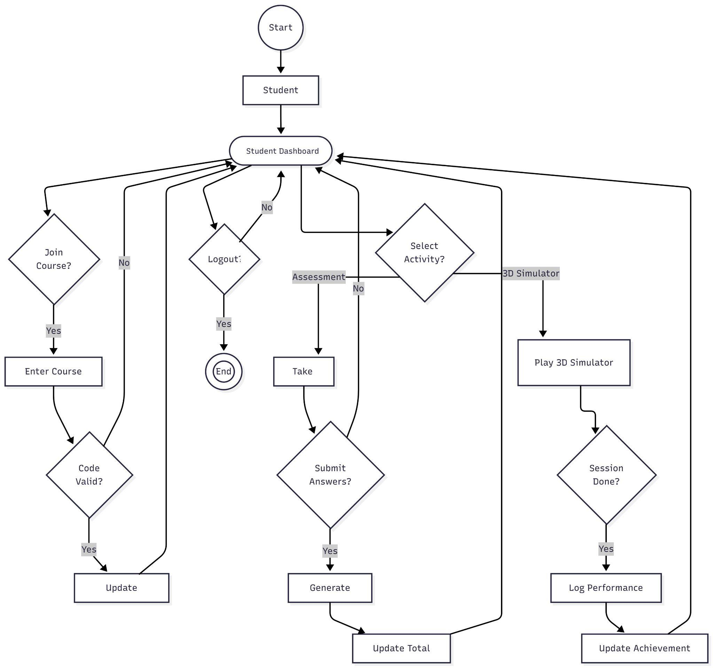

> **Software** **Requirements** **Specification**
>
> **COSC** **75:** **Software** **Engineering** **II**
>
> **for**

**CTRL** **ACADEMY:** **A** **Learning** **Management** **System**
**for** **Automotive** **Students** **of** **CvSU**

> CTRL C
>
> **Document** **Revision** **No.:**
>
> **Date** **of** **issue:**
>
> **Project** **Manager/Group** **Members:**
>
> **Dilag,** **Rembelle** **R.** **Abrau,** **James** **A.** **Curay,**
> **Jonel** **A.** **Estabillo,** **Erick** **Vince**
>
> **Table** **of** **Contents**
>
> **Table** **of** **Contents** **ii** **Revision** **History** **ii**
> **1.** **Introduction** **1** 1.1 Purpose
> [1](https://docs.google.com/document/d/1piM1LotpEUUWa9Rwo4l_2MM251OXuDcu/edit#heading%3Dh.l6qm623sus67)
> 1.2 Intended Audience and Reading Suggestions 1
>
> 1.3 Product Scope
>
> **2.** **Overall** **Description** **2** 2.1 Product Perspective 2 2.2
> Product Functions 2 2.3 System environment 2 2.4 User Classes and
> Characteristics 2 2.5 Design and Implementation Constraints 2 2.6 User
> Documentation 2
>
> **3.** **External** **Interface** **Requirements** **3** 3.1 User
> Interfaces 3 3.2 Hardware Interfaces 3 3.3 Software Interfaces 3 3.4
> Communications Interfaces 3
>
> **4.** **System** **Features** **and** **Requirements** **4** 4.1
> Functional Requirements 4 4.2 Non-Functional Requirements 4 4.3 Other
> Features
>
> **5.** **System** **design** **and** **modeling**
>
> 5.1 Description of procedures and functions 4 5.2 Use-case diagram 4
> 5.3 Data flow diagram 4 5.4 Entity Relationship Diagram (ERD) 4 5.5
> Activity Diagram 4
>
> **6.** **Appendices** **4** 6.1 Glossary 4 6.2 References 4
>
> **Revision** **History**

||
||
||
||
||

**1.** **Introduction**

**1.1** **Purpose**

> This Software Requirements Specification (SRS) document defines the
> complete set of functional and non-functional requirements for the
> LMS-based 3D Vehicle Components Assembly Simulator, developed by Team
> CTRL C. The system is designed to function as a comprehensive,
> web-based Learning Management System (LMS) that facilitates the
> education and assessment of automotive students at Cavite State
> University. It aims to enhance learning by integrating structured
> course content focused on the seven core vehicle components, gamified
> learning modules for effective student practice, and an embedded 3D
> simulator primarily used by the instructor for detailed visual
> demonstrations. Furthermore, the system includes a dedicated web-based
> quiz application for formal student evaluation and progress tracking.
> Ultimately, the system provides an engaging, technology-driven, and
> scalable educational environment that complements traditional
> laboratory instruction.

**1.2** **Intended** **Audience** **and** **Reading** **Suggestions**

> This document is intended for:
>
> ● **Developers** – To implement and maintain the system’s features and
> architecture based on the defined specifications.
>
> ● **Project** **Managers** **and** **System** **Analysts** – To
> oversee project progress, manage resources, and ensure that all
> requirements are met during development.
>
> ● **Testers** – To validate and verify that the system’s functions
> perform according to the specified requirements and quality standards.
>
> ● **Instructors** – Need to understand system architecture, content
> management, 3D demonstration operation, quiz creation, and progress
> reporting.
>
> ● **Students** – To understand how to utilize the simulator for
> virtual practice and complete assigned assembly assessments.
>
> In reading the document, readers are advised to review the
> Introduction and Overall Description sections first to understand the
> system’s goals and context before proceeding to the detailed System
> Requirements section.

**1.3** **Product** **Scope**

> The **LMS-based** **3D** **Vehicle** **Components** **Assembly**
> **Simulator** is a centralized, web-accessible
>
> platform that operates as the primary digital education and assessment
> hub for automotive
>
> students.
>
> The scope is defined by the following integrated systems and
> constraints:
>
> ● **LMS** **Core** **Functionality:** A scalable, web-based platform
> that manages user accounts, delivers structured course content on the
> seven core vehicle components, and tracks learning progress.
>
> ● **Integrated** **3D** **Simulation** **Subsystem:** The 3D simulator
> is an embedded module accessible to both user roles. It functions as a
> visual teaching aid for Instructors to perform class demonstrations,
> while simultaneously serving as an interactive practice environment
> for Students to perform virtual assembly and disassembly tasks.
>
> ● **Gamified** **Learning** **Modules:** The platform includes
> interactive games and practice modules designed for student
> self-guided practice and knowledge reinforcement.
>
> ● **Web-Based** **Quiz** **System:** Instructors can create and deploy
> quizzes via the web, and students can take these assessments online.
>
> ● **Progress** **Tracking** **and** **Reporting:** The system must
> record and display each student's activity results, gamified module
> performance, and quiz scores for instructor evaluation.

**2.** **Overall** **Description**

**2.1** **Product** **Perspective**

> The 3D Vehicle Components Assembly Simulator is a specialized,
> web-based Learning
>
> Management System (LMS). It functions as a centralized, digital
> learning and assessment environment for automotive students at Cavite
> State University, accessible via a standard web browser. This unified
> platform integrates three core, web-accessible components:
>
> ● **LMS** **Core** **&** **Content** **Management:** Manages user
> authentication, structured learning
>
> content focused on the seven core vehicle components, gamified
> learning paths, and progress tracking.
>
> ● **Web** **Quiz** **Management** **Subsystem:** Allows instructors to
> create, deploy, and manage quizzes, and collects, stores, and
> validates student assessment responses in the central database.
>
> ● **3D** **Simulation** **Subsystem:** An embedded module (using Godot
> Engine v4) used as a visual teaching aid to perform 3D assembly and
> disassembly demonstrations for the class.

**2.2** **Product** **Functions**

> The system provides the following functions within the LMS
> environment:
>
> ● **Structured** **Learning** **Content** **Access:** Users can
> navigate organized learning modules, theory, and multimedia resources
> focused on the seven core vehicle systems.
>
> ● **Engage** **with** **Integrated** **3D** **Simulation**
> **Subsystem:** Students can launch the embedded 3D simulation feature
> to virtually assemble and disassemble vehicle components. The
> interface guides them through the proper sequence and placement.
>
> ● **Participate** **in** **Gamified** **Modules:** Students can access
> interactive, game-based exercises within the LMS to test and reinforce
> their knowledge of component relationships.
>
> ● **Take** **Web-Based** **Quizzes:** Students can participate in
> instructor-created quizzes via the web platform, and results are
> automatically recorded and stored in the central database.
>
> ● **Track** **and** **Review** **Progress:** The system records each
> student's progress, quiz performance, and simulation activities. Both
> students and instructors can view and export these records.

**2.3** **System** **Environment**

> **Development** **Environment**
>
> ● **Hardware:** Developer laptops/desktops with Intel Core i5 or AMD
> Ryzen 5, 16GB RAM,
>
> 512GB SSD, and GTX 1050 Ti or equivalent GPU.
>
> ● **Software:** XAMPP (Apache, MySQL), Visual Studio Code, ReactJS,
> PHP, Godot Engine v4.x, Figma, Blender. Client-side storage (e.g.,
> LocalStorage or IndexedDB) is used for temporary session data.
>
> ● **Network:** Local LAN for collaboration and LAN feature testing. ●
> **Version** **Control:** Git/GitHub.
>
> **Testing** **Environment**
>
> ● **Simulator** **Testing** **(PC):** Desktop PCs with Intel i5, 8GB
> RAM, and integrated graphics
>
> supporting WebGL 2.0.
>
> ● **LMS/Quiz** **Testing** **(Mobile):** Android smartphones (v10+)
> and standard mobile web browsers.
>
> ● **Staging** **Server:** Localhost environment via XAMPP for feature
> validation before deployment.
>
> **Production** **Environment**
>
> ● **Server** **Infrastructure** **(Backend)**
>
> ○ **Host:** University-hosted server or dedicated desktop acting as
> the local server.
>
> ○ **Software:** Apache HTTP Server (or Nginx), MySQL/MariaDB Database,
> and PHP. *Note:* *XAMPP* *is* *replaced* *by* *standalone* *services*
> *for* *security.*
>
> ○ **Network:** Campus LAN (Local Area Network) or stable Internet
> connection (TCP/IP) for handling concurrent user requests.
>
> ● **Client** **Workstations** **(Frontend)**
>
> ○ **Student/Instructor** **PCs:** Windows 10/11 Desktop Computers with
> a modern web browser (Chrome/Edge).
>
> ○ **Minimum** **Specs** **for** **Simulator:** 4GB RAM, Quad-core CPU,
> and GPU with WebGL 2.0 support (e.g., Intel UHD 630 or better) to run
> the embedded Godot module smoothly.
>
> ○ **Mobile** **Devices:** Android smartphones (v10+) connected via
> LAN/Wi-Fi for accessing LMS content, quizzes, and progress reports (3D
> Simulator not supported on mobile).

**2.4** **User** **Classes** **and** **Characteristics**

> **User** **Class**
>
> Instructors

**Description**

Serve a dual role as course

**Access/Privileges**

\- Full access to content and

> managers and subject user management; exclusive instructors.. They use
> the right to launch and operate the simulator to demonstrate 3D
> Simulator for vehicle systems, guide demonstration.
>
> students through assembly - Can create, edit, and delete activities,
> and manage quizzes.
>
> quizzes and performance - Manage user accounts and tracking.
> Instructors possess system configurations moderate technical - View,
> export, and back up knowledge and are reports and performance data.
> responsible for maintaining
>
> user accounts and overseeing system operations.
>
> Students Primary end-users who - Access to learning modules
>
> interact with the LMS, and gamified features; content, gamified
> modules, participate in web-based and web-based quizzes. quizzes and
> can launch or directly control the 3D
>
> Simulation module.
>
> \- Participate in web-based quizzes
>
> \- View individual performance and progress results
>
> Each user class has different levels of technical expertise.
> Administrators typically possess moderate IT knowledge, while regular
> users are expected to operate the system easily through an intuitive
> and user-friendly interface that requires minimal guidance.

**2.5** **Design** **and** **Implementation** **Constraints**

> The design and implementation of the LMS-based 3D Vehicle Components
> Assembly
>
> Simulator are governed by a set of technical and institutional
> constraints to ensure efficient, secure,
>
> and compliant deployment. The core 3D simulator module must be
> lightweight and built using Godot
>
> Engine v4.x and GDScript to maintain efficient performance on standard
> classroom desktop computers. Crucially, the system is designed to
> allow access to the general LMS features (e.g., content navigation,
> quizzes, progress reports) across various devices. However, the core
> 3D component assembly simulator is exclusively supported for PC-based
> execution (desktop computers) and is not functional on mobile devices
> (smartphones or tablets) due to its intensive graphical and processing
> requirements. Because the entire system is LMS-based, a crucial
> constraint for all accessing devices is the requirement for a stable
> internet connection. This connection facilitates real-time
> communication between the local client and the centralized server,
> which is necessary for secure user authentication, retrieving course
> content, and, most importantly, transmitting and storing critical
> student performance data (such as assembly attempts, scores, and time
> metrics) in the server-side database (e.g., MySQL or PostgreSQL).
> Local data handling is restricted to temporary or cached information
> using lightweight methods like SQLite or JSON. Finally, the entire
> system must strictly adhere to the established Cavite State University
> IT policies and academic standards, which dictate rigid guidelines for
> data security, student data privacy, and mandatory software
> maintenance protocols.

**2.6** **User** **Documentation**

> The system documentation is designed to ensure comprehensive user
> understanding and
>
> system operation, consisting of three main components. The User Manual
> provides detailed, role-specific instructions: for students, it covers
> registration, navigation of the LMS content and gamified modules, and
> taking web-based quizzes; for Instructors, it outlines user account
> management, operation of the 3D demonstration simulator, quiz
> creation, and report generation. This manual also includes
> explanations of the LMS subsystems, an interface overview, and
> troubleshooting tips for common web-access issues.
>
> Secondly, the Installation Guide provides step-by-step technical
> procedures for setting up the
>
> environment, including the Web Server, Database (e.g., MySQL), and the
> LMS application
>
> deployment, covering recommended hardware/software, network
> configuration (HTTP/HTTPS), and server security settings. Finally, the
> In-App Manual is integrated directly into the LMS, offering quick,
> contextual access to feature descriptions, quiz instructions, and
> specific control references for the Instructor's 3D demonstration
> interface. These resources collectively ensure users can easily learn
> and operate the system without external assistance, supporting a
> seamless self-guided learning experience for students and an effective
> teaching experience for instructors.

**3.** **External** **Interface** **Requirements**

**3.1** **User** **Interfaces**

> The LMS-based 3D Vehicle Components Assembly Simulator uses a clean
> interface design
>
> tailored for both web and desktop screens. All web pages follow
> consistent UI patterns such as structured content modules, progress
> charts, and clear navigation elements for easy access to courses and
> quizzes. Standard LMS actions, including enrollment, submission, and
> grading, are clearly labeled within the web interface. The core 3D
> simulator module, optimized for desktop, uses familiar screen layouts
> to ensure students can navigate quickly between assembly steps, parts
> inventory, and instructional guidance. The instructor dashboard
> follows an accessible design displaying detailed student reports,
> course management tools, and controls for operating the 3D
> demonstration simulator.

**3.2** **Hardware** **Interfaces**

> The LMS web platform must be accessible and function reliably on
> standard desktop
>
> computers as well as typical smartphone devices for accessing content,
> quizzes, and progress
>
> reports. However, client-side execution of the intensive 3D component
> assembly simulator requires access to standard desktop computers with
> sufficient processing power and dedicated graphics capabilities. The
> server infrastructure requires a robust web server and an optimized
> database server capable of handling secure user authentication,
> managing centralized course content, and processing the large volume
> of student performance data. User input is handled primarily through
> standard keyboard and mouse peripherals when using the desktop
> simulator, and via touch or pointer input for the web-based LMS on
> smartphones and desktops.

**3.3** **Software** **Interfaces**

> The LMS-based 3D Vehicle Components Assembly Simulator integrates the
> following software
>
> components and functionalities:
>
> ● **3D** **Simulator:** The desktop application is developed using
> **Godot** **Engine** **v4.x** with **GDScript** as the primary
> scripting language, leveraging Godot's built-in APIs for rendering,
> animation, and event management.
>
> ● **Simulator** **Operation:** The core simulator is designed to
> operate independently, focusing solely on providing an interactive 3D
> environment for assembly and disassembly tasks.
>
> ● **Instructor** **Functionality:** Instructors are provided with
> capabilities to generate and export reports in Microsoft Excel or PDF
> format.
>
> ● **Internal** **Communication:** The software supports communication
> between subsystems (Simulation, Quiz, and Tracking) through internal
> data handlers built into the Godot framework to ensure smooth data
> flow across all functional components.

**3.4** **Communications** **Interfaces**

> The system relies on robust communication interfaces for its core
> functionality:
>
> ● **Network** **Protocols:** All communication between client devices
> (PC for the 3D simulator,
>
> PC/Smartphone for the web LMS) and the central server uses the
> **TCP/IP** protocol suite.
>
> ● **University** **Email** **Integration:** The system will integrate
> with the **Cavite** **State** **University** **(CvSU)** **email**
> **system** for critical user processes, including account registration
> confirmation, password reset requests, and essential system
> notifications.
>
> ● **Client** **Communication** **Application:** The primary interface
> for accessing the web-based LMS is a modern Web Browser (e.g., Chrome,
> Firefox, Edge) used by students and instructors on their PCs and
> smartphones.

**4.** **System** **Features** **and** **Requirements**

**4.1** **Functional** **Requirements**

> **LMS** **Core** **and** **User** **Management**
>
> ● **Secure** **Authentication:** The system must provide a secure,
> web-based login/logout process for all users (Professors and
> Students).
>
> ● **Account** **Customization:** The system must allow users to update
> profile information, change passwords, and toggle between Light and
> Dark themes.
>
> ● **Course** **Enrollment:** The system must allow students to enroll
> in specific courses using unique alphanumeric instructor-generated
> course codes.
>
> ● **User** **Lifecycle** **Management:** The system must provide a
> "Danger Zone" for secure account deletion and allow Professors to
> manage student account statuses.
>
> **Learning** **and** **Gamified** **Learning** **Modules**
>
> ● **7** **Systems** **Explorer:** The system must provide an
> interactive 3D-style exploration guide for
>
> the seven core vehicle components.
>
> ● **Spaced-Repetition** **Flashcards:** The system must allow students
> to create, manage, and study digital flashcards to master technical
> terms.
>
> ● **Interactive** **Game** **Suite:** The system must offer five
> distinct interactive games: **Fault** **Roulette**, **Service**
> **Writer**, **Cross-System**, **Tool** **Select**, and **Code**
> **Cracker**.
>
> ● **Performance** **Metrics:** The system must record the student's
> score, completion time, and difficulty level upon completion of any
> module.
>
> **3D** **Demonstration** **Subsystem**
>
> ● **Unified** **Simulator** **Interface:** The system must provide a
> Godot-embedded 3D simulator
>
> that offers an identical visual interface and control scheme for both
> Professors and Students. ● **Assembly/Disassembly** **Logic:** The
> interface must allow users to perform virtual,
>
> step-by-step assembly and disassembly of vehicle components.
>
> ● **Standardized** **Controls:** The system must provide a universal
> set of camera and manipulation controls (zoom, pan, rotate) accessible
> to all authenticated users within the simulator.
>
> **Web** **Quiz** **Management**
>
> ● **Quiz** **Lifecycle:** The system must allow Professors to create
> and deploy quizzes with
>
> defined time limits and attempt constraints.
>
> ● **Progress** **Visualization:** The system must display student
> progress via weekly activity bar
>
> charts, total points, and class rank.
>
> ● **Achievement** **System:** The system must award digital badges
> (e.g., "First Century," "Rising Star") based on student milestones.
>
> ● **Reporting:** The system must allow Professors to generate and
> export detailed performance reports in CSV or PDF format.

**4.2** **Non-Functional** **Requirements**

> **Non-Functional** **Requirements**
>
> **Performance**
>
> ● The LMS main dashboard and content pages must load completely within
> **3** **seconds** over a standard campus network connection.
>
> ● The Integrated 3D Simulation Subsystem must load and initialize for
> viewing within **10** **seconds** of being launched.
>
> ● The system must reliably support **50** **concurrent** **student**
> **users** taking a quiz without any noticeable degradation in response
> time.
>
> **Security**
>
> ● All user sessions must utilize the **HTTPS/SSL** **protocol** for
> encrypted communication.
>
> ● All sensitive data (passwords, student IDs, quiz results) must be
> stored using **industry-standard** **hashing** **and** **encryption**
> **techniques**.
>
> ● The system must strictly enforce role-based access control, ensuring
> only Instructors can access management and demonstration features.
>
> **Reliability** **and** **Availability**
>
> ● The LMS platform must be available for use **99%** of the scheduled
> operating time, excluding planned maintenance.
>
> ● The system must utilize database transaction controls and regular
> backups to ensure data integrity and prevent the loss of submitted
> quiz data or progress records.
>
> **Usability**
>
> ● The LMS interface must be fully **responsive** and functional across
> all major desktop and mobile screen resolutions.
>
> ● Students must be able to complete core tasks (e.g., submitting a
> quiz, launching a gamified
>
> module) successfully on their first attempt with minimal reliance on
> external instructions.

**4.3** **Other** **Requirements**

> The system must comply with university data security policies and all
> 3D assets must be
>
> original or licensed. The provider will also offer maintenance for six
> months post-deployment as per
>
> the Letter of Agreement.
>
> **5.** **System** **design** **and** **modeling**
>
> **5.1** **Description** **of** **procedures** **and** **functions**

The system procedures are now governed by a centralized, web-based
Learning Management System (LMS) that manages data flow between the
client browser and the server.

> ● **User** **Access** **and** **Authentication:** Both students and
> instructors access the system via a
>
> web browser and a secure login page. Upon authentication, the system
> verifies the user's
>
> role (Student or Instructor) against the central database to determine
> access privileges and
>
> route the user to the appropriate dashboard.
>
> ● **Student** **Learning** **Cycle:** Students access the LMS
> dashboard to view structured learning modules (covering the 7 core
> components). They engage in **Gamified** **Practice** **Activities**
> for self-assessment, with their scores and completion status recorded
> instantly.
>
> ● **Instructor** **Demonstration:** Instructors use their elevated
> privileges to launch the **3D** **Demonstration** **Subsystem**
> directly from their dashboard. This module runs embedded in the
> browser, allowing the instructor to use a dedicated interface to
> control and present the assembly and disassembly processes to the
> class without student interference.
>
> ● **Quiz** **Lifecycle:** Instructors create and manage quizzes using
> a dedicated web interface, setting parameters like time limits and
> availability. Students take these quizzes securely through the web
> platform. The system automatically grades the submission and stores
> the final result in the central database, making it available for
> instructor reporting.
>
> ● **Progress** **Tracking** **and** **Reporting:** The system
> continuously monitors and logs all student activity (content access,
> gamification scores, quiz results). Instructors can access, filter,
> and export comprehensive performance reports from a secure
> administrative panel.

> **5.2** **Use-case** **diagram**
>
> *Figure* *1:* *Use* *Case* *Diagram.*

Figure 1 illustrates the functional relationship between two primary
actors: the Student and Instructor; their

roles fulfill complementary functions to facilitate learning and
administration. The Student is primarily

responsible for active participation and knowledge acquisition, which
involves enrolling in courses, studying

modules, managing flashcards, and completing gamified activities or
web-based quizzes to validate their learning. On the other hand, the
Instructor serves as the system administrator and facilitator, tasked
with managing the actual course content, designing quizzes, and
generating analytical reports to monitor class performance. Both actors
converge on a set of shared core functionalities, including role-based
login and account deletion for security, profile customization for
personalization, and access to the 3D simulator and progress tracking to
evaluate engagement within the platform.

> **5.3** **Data-flow** **Diagram**
>
> *Figure* *2:* *Data* *Flow* *Diagram.*

Figure 2 presents the exchange of information between the Student,
Instructor, and the four core processes of the

Learning Management System (LMS). The diagram illustrates how data is
securely managed, starting with Process

1.0 (User Lifecycle & Auth Management), where both actors submit login
and profile data for verification against the

central User Store (D1), allowing the Instructor to perform
administrative duties like managing student account statuses or secure
deletions. The academic heart of the system is captured in Process 2.0
(LMS Content & Quiz Management), where the Instructor designs course
materials and quizzes that are archived in the Quiz Bank (D2), while
Students interface with this process by providing unique course
enrollment codes to access lessons and

submitting their completed web-based quizzes for validation. Interactive
engagement is facilitated through Process 3.0 (3D & Gamified Learning),
where both actors utilize the Godot-embedded 3D Simulator Subsystem
featuring standardized camera and part controls for demonstrations or
self-guided practice. While the Instructor uses this for visual teaching
aids, the Student participates in gamified play, generating critical
session metrics such as scores, completion time, and difficulty levels,
that are recorded in the Performance & Activity Logs (D3). Finally,
Process 4.0 (Progress Tracking & Reporting) bridges the gap between raw
data and actionable insight by pulling analytics from the Activity Logs
and raw results from the Quiz Subsystem to deliver visual progress
charts and dashboard visualizations back to the Student for
self-monitoring, while providing the Instructor with the comprehensive
CSV or PDF performance reports necessary for official evaluation.

> **5.4** **Entity** **Relationship** **Diagram**
>
> *Figure* *3:* *Entity* *Relationship* *Diagram.*

Figure 3 represents a streamlined database structure where
authentication and role-specific data are merged directly

into the Instructor and Student entities. The Instructor is defined by
attributes such as Name, Email, and Password, and holds a primary
Manages relationship with Courses along with an Evaluates relationship
that oversees student results. The Student entity tracks progress
through Total Points and Achievement Rank, connecting to the academic
structure via the Enrolls in relationship and to the 3D simulator
through the Interacts with relationship. Central to the system is the
Courses entity, which contains the Quiz modules and links to the
Enrollment bridge to manage student registration data. Performance
logging is finalized through the Quiz Attempt entity, which stores
Scores, and the Gamified Session entity, which captures
simulator-specific metrics like Module Name and Completion Time to
provide a complete record of user activity.

>  style="width:5.79167in;height:4.71875in" />**5.5** **Activity**
> **Diagram**
>
> *Figure* *4:* *Activity* *Diagram* *for* *Instructor* *Workflow*

Figure 4 illustrates the Instructor workflow as a centralized,
decision-driven process that provides administrative control over course
materials and student data. Upon reaching the Instructor Dashboard, the
user encounters a primary decision node that directs the flow into four
functional branches: updating course content, viewing performance logs,
managing the student roster, or creating assessments. To maintain data
integrity and prevent accidental deployments, each branch is reinforced
with a confirmation diamond, such as "Save", "Export", "Remove", or
"Create Quiz?", which serves as a gateway to final actions like
committing updates to the database, downloading performance analytics,
updating the enrollment list, or deploying the new quiz. The system's
logic employs a loop-back mechanism that returns the instructor to the
main dashboard after every operation or cancellation, allowing for
continuous task management until the user triggers the final log out
sequence.

> *Figure* *5:* *Activity* *Diagram* *for* *Student* *Workflow*

Figure 5 illustrates the Student workflow as an interactive and
decision-driven process centered on academic participation and
performance tracking. Upon entering the Student Dashboard, the user can
choose to join a course, participate in a learning activity, or log out.
If the student selects the join course option, a decision diamond
verifies the validity of the enrollment code before updating the
database and returning the user to the dashboard. The central activity
node allows students to select an activity from the assessment category,
which encompasses both the 3D simulator and traditional/gamified
quizzes. Each path contains confirmation diamonds such as "Submit
Answers?" or "Session Done?" to ensure data is only recorded upon
completion. The quiz path triggers score generation to update total
points, while the simulator path logs technical performance to refresh
the student achievement rank. A loop-back mechanism is employed
throughout the system to return the student to the main dashboard after
every operation, ensuring the session remains active until a final log
out is confirmed.

> **6.** **Appendices** **Appendix** **A:** **Glossary**

||
||
||
||
||
||
||
||
||
||

||
||
||
||
||
||
||
||
||
||
||

||
||
||
