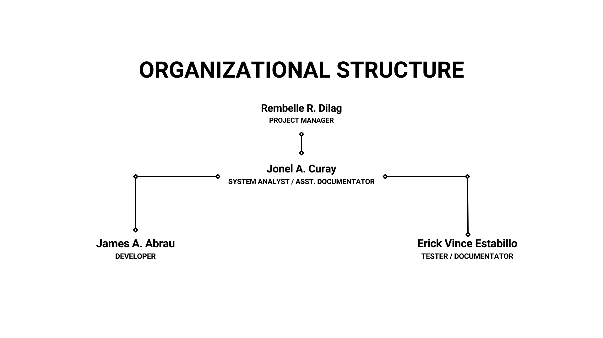
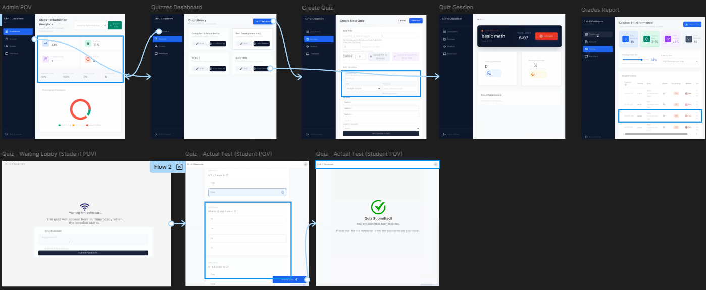
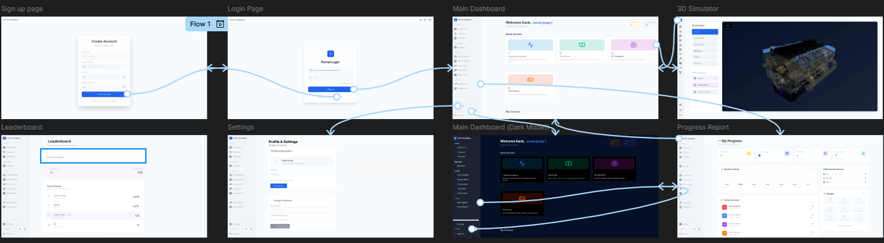
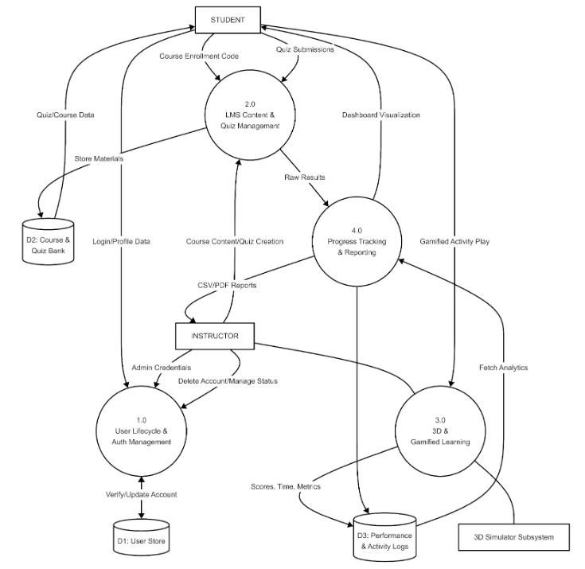
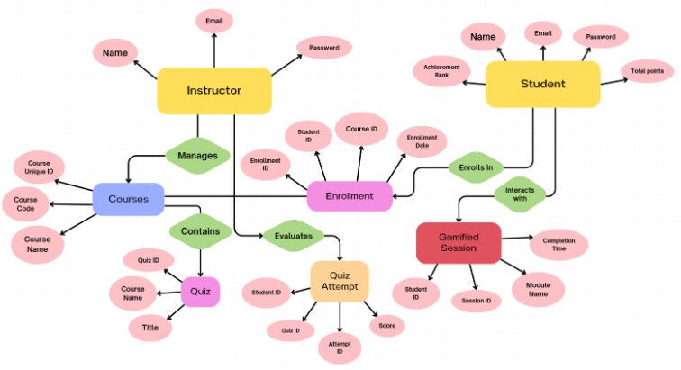
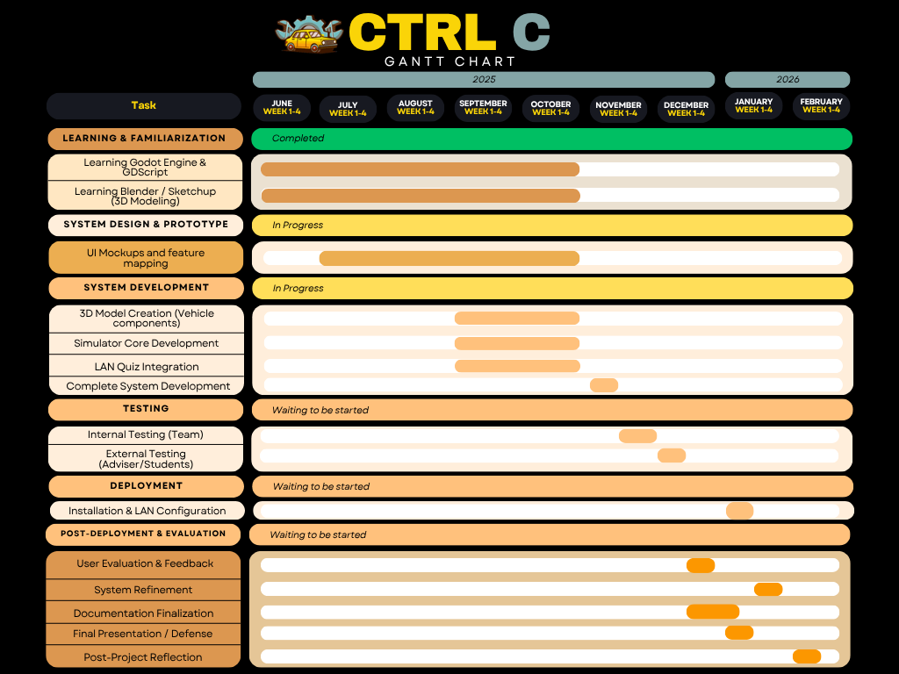

> **Project** **Plan** **COSC** **75:** **Software** **Engineering**
> **II**
>
> **CTRL+C** **Educational** **Suite** **Control,** **Create,**
> **Compete** **—** **The** **Complete** **AI-Powered** **Automotive**
> **Education** **Ecosystem** **for** **Tomorrow's** **Technicians**
>
> **Cavite** **State** **University** **College** **of** **Engineering**
> **and** **Information** **Technology**
>
> **Department** **of** **Industrial** **Engineering** **and**
> **Technology** **Indang,** **Cavite**
>
> **Document** **Revision** **No.:1**
>
> **Date** **of** **Issue:** **12/19/2025**
>
> **Project** **Manager/Group** **Members:**
>
> **Project** **Manager** **-** **Dilag,** **Rembelle** **R.**
>
> **Developer** **-** **Abrau,** **James** **A.**
>
> **System** **Analyst** **-** **Curay,** **Jonel** **A.**
>
> **Tester** **-** **Estabillo,** **Erick** **Vince**
>
> Rembelle R. Dilag Jonel A. Curay
>
> Prepared by: Project Manager, CTRL C Prepared by: System
> Analyst/Documenter, CTRL C
>
> James A. Abrau Erick Vince Estabillo
>
> Prepared by: Developer, CTRL C Prepared by: Tester/Documenter, CTRL C
>
> Erick Vince Estabillo
>
> Reviewed by: Tester/Documenter, CTRL C

||
||
||
||

> **Table** **of** **Contents**
>
> **1.** **The** **Problem** **Domain** **6**
>
> 1.1 Statement of the Problem 6
>
> 1.2 Background and Rationale 6
>
> 1.3 Objectives 6
>
> 1.4 Significance and Scope of the Project 7
>
> **2.** **Project** **Organization** **8**
>
> 2.1 External Interfaces 8
>
> 2.2 Internal Structure 8
>
> 2.3 Roles and Responsibilities 9
>
> 2.4 Deliverables 9
>
> **3.** **Review** **of** **Existing** **Alternatives** **11**
>
> **4.** **Approach** **to** **be** **taken** **in** **this**
> **subject**
> **[1](https://docs.google.com/document/d/15chOyx6uPg4Fbw1z6qgbVj-w5xHstdGv/edit#heading=h.39kk8xu)3**
>
> 4.1 Theoretical Framework / Methods to be Used 13
>
> 4.2 Rationale for the Framework / Methods
> [1](https://docs.google.com/document/d/15chOyx6uPg4Fbw1z6qgbVj-w5xHstdGv/edit#heading=h.48pi1tg)3
>
> 4.3 Technologies you plan to consider or use 14
>
> **5.** **System** **Design**
> **[1](https://docs.google.com/document/d/15chOyx6uPg4Fbw1z6qgbVj-w5xHstdGv/edit#heading=h.3mzq4wv)5**
>
> 5.1 Requirements
> [1](https://docs.google.com/document/d/15chOyx6uPg4Fbw1z6qgbVj-w5xHstdGv/edit#heading=h.2250f4o)5
>
> 5.2 Resources 17
>
> 5.3 System Overview
> [1](https://docs.google.com/document/d/15chOyx6uPg4Fbw1z6qgbVj-w5xHstdGv/edit#heading=h.319y80a)8
>
> **6.** **Project** **Timeline** **26**
>
> 6.1 Gantt Chart 26
>
> 6.2 Work Breakdown Structure 27
>
> **7.** **Budget** **Allocation** **29**
>
> 7.1 Estimated Costs 29
>
> 7.2 Total Projected Budget 29
>
> **References** **30**

||
||
||
||

> **Document** **Change** **Control**
>
> This section provides control for the development and distribution of
> revisions to the Project Charter up to the point of approval. The
> Project Charter does not change throughout the project life cycle, but
> rather is developed at the beginning of the project (immediately
> following project initiation approval, and in the earliest stages of
> project planning). The Project Charter provides an ongoing reference
> for all project stakeholders. The table below includes the revision
> number (defined within your Documentation Plan Outline), the date of
> update/issue, the author responsible for the changes, and a brief
> description of the context and/or scope of the changes in that
> revision.

||
||
||
||

||
||
||
||

> **Disclaimer**
>
> This project plan is submitted to the College of Engineering and
> Information Technology (CEIT), Cavite State University - Indang,
> Cavite, in partial fulfillment of the requirements for COSC 75:
> Software Engineering II. It is the original work of the authors,
> except where references are explicitly cited.
>
> The content of this document, including but not limited to the report,
> source code, and related materials, may be used, copied, or
> distributed for academic and research purposes, provided that proper
> acknowledgment is given to the authors and Cavite State University.
> Unauthorized use for commercial purposes without prior consent is
> strictly prohibited.

||
||
||
||

> **Abstract**
>
> The CTRL+C Educational Suite is an AI-powered automotive education
> ecosystem developed to modernize teaching, learning, and assessment in
> automotive technology programs. The system integrates two
> interconnected yet independent applications: **Ctrl** **C**
> **Academy**, an automotive-focused Learning Management System (LMS),
> and **InsightQuiz** **Pro**, an intelligent assessment and analytics
> platform.
>
> The project combines interactive 3D simulations, gamified learning
> activities, diagnostic training tools,
>
> flashcards with spaced repetition, and AI-assisted content generation
> to deliver an engaging, student-centered learning environment.
> Instructors are supported through automated quiz generation, live and
> asynchronous assessments, performance analytics, and insights into
> student learning strengths using Multiple Intelligences analysis.
>
> The CTRL+C Educational Suite addresses key challenges in automotive
> education, including limited
>
> laboratory resources, safety concerns, and inconsistent assessment
> practices. By providing a scalable, data-driven, and
> technology-enhanced platform, the system aims to improve learning
> outcomes, instructional efficiency, and accessibility in automotive
> education.

||
||
||
||

> **I.** **The** **Problem** **Domain**
>
> **1.1.** **Statement** **of** **the** **Problem**
>
> Automotive education programs face persistent challenges such as
> limited access to physical laboratory equipment, high costs of
> automotive components, safety risks during hands-on training, and
> difficulty in consistently evaluating student performance. Traditional
> instructional methods and isolated simulation tools often fail to
> provide continuous engagement, personalized feedback, and integrated
> assessment mechanisms aligned with modern educational needs.
>
> **1.2.** **Background** **and** **Rationale**
>
> Advancements in educational technology, artificial intelligence, and
> interactive 3D visualization present opportunities to significantly
> improve technical and vocational education. Automotive programs, in
> particular, benefit from platforms that combine theoretical
> instruction, practical simulation, assessment, and analytics within a
> unified environment. The CTRL+C Educational Suite was conceptualized
> to address these needs by delivering an integrated,
> automotive-specific digital learning ecosystem that supports both
> students and instructors.
>
> **1.3.** **Objectives**
>
> The general objective of the project is to develop an integrated
> automotive education ecosystem that supports learning, practice, and
> assessment through modern digital technologies.
>
> Specifically, the project aims to:
>
> ● Develop an AI-powered learning management system for automotive
> education.
>
> ● Provide interactive 3D visualization of the seven major automotive
> systems.
>
> ● Implement gamified learning activities to improve student engagement
> and motivation.
>
> ● Enable intelligent quiz generation, grading, and learning analytics.
>
> ● Support instructors with tools for course management, assessment,
> and performance monitoring.

||
||
||
||

> **1.4.** **Significance** **and** **Scope** **of** **the** **Project**
>
> The CTRL+C Educational Suite benefits students by offering an
> engaging, self-paced, and skills-oriented learning environment that
> enhances understanding of automotive systems without the risks
> associated with physical laboratories. Instructors benefit from
> reduced manual workload, data-driven insights, and improved classroom
> and assessment management.
>
> The scope of the project includes the design and development of two
> interconnected applications intended for academic use: an automotive
> LMS and an assessment and analytics system. The system focuses on
> learning support, simulation, and evaluation.

||
||
||
||

> **II.** **Project** **Organization**
>
> **2.1.** **External** **Interfaces**
>
> The system interacts with the following external stakeholders:
>
> ● **Students**: Primary users who access learning materials,
> simulations, games, and assessments.
>
> ● **Instructors**: Users who manage courses, quizzes, analytics, and
> feedback.
>
> ● **Educational** **Institutions**: Adopt and integrate the system
> into automotive programs. ● **Adviser** **and** **Panel** **Members**:
> Provide guidance and evaluate project progress.
>
> **2.2.** **Internal** **Structure**
>
>  style="width:8.05942in;height:4.53948in" />The project is developed by
> the CTRL C team using a collaborative structure led by the Project
> Manager. Each member contributes to planning, development, testing,
> and documentation to ensure quality and system reliability.
>
> *Figure* *1.* *Organizational* *Structure* *of* *the* *Project* *Team*
>
> The organizational structure of CTRL C is led by the Project Manager,
> who oversees planning,
>
> coordination, and progress tracking. The Developer is responsible for
> system implementation and technical integration. The System Analyst
> and Tester contribute to requirements analysis, quality assurance, and
> documentation. This structure ensures collaboration, accountability,
> and efficient project execution.

||
||
||
||

> **2.3.** **Roles** **and** **Responsibilities**
>
> Each member of the project team plays an essential role in ensuring
> the successful completion of the *CTRL+C* *Educational* *Suite*. The
> team practices collaborative development, where members contribute
> their expertise while supporting one another in various phases of the
> project such as planning, development, testing, and documentation. The
> specific roles and responsibilities are as follows:
>
> **●** **Rembelle** **R.** **Dilag** **–** **Project** **Manager**
>
> Responsible for overseeing the overall progress of the project.
> Ensures that development
>
> schedules are followed, deliverables are met, and tasks are properly
> delegated among team
>
> members. Maintains communication with the adviser, manages project
> documentation, and ensures that the system adheres to technical and
> academic standards.
>
> **●** **James** **A.** **Abrau** **–** **Developer**
>
> Handles the programming and implementation of system functions using
> Three.js and JavaScript. Develops the simulator interface, manages the
> integration of 3D vehicle models, and assists in configuring the
> learning management and LAN-based quiz system. Contributes to
> troubleshooting and optimization during the testing phase.
>
> **●** **Jonel** **A.** **Curay** **–** **System** **Analyst** **/**
> **Assistant** **Documentator**
>
> Conducts requirement analysis, assists in designing the system
> structure, and ensures that the project meets the needs of students
> and instructors. Helps in preparing diagrams and flowcharts for system
> documentation and contributes to writing and reviewing project
> reports.
>
> **●** **Erick** **Vince** **Estabillo** **–** **Tester** **/**
> **Documentator**
>
> Leads system testing and quality assurance activities. Identifies and
> documents system bugs, verifies fixes, and ensures the overall
> stability and usability of the simulator. Responsible for preparing
> technical documentation, user manuals, and presentation materials.
>
> **2.4.** **Deliverables**
>
> The CTRL+C Educational Suite project will produce a comprehensive set
> of tangible outputs that
>
> demonstrate the system’s development progress, functionality, and
> readiness for academic use. These

||
||
||
||

> deliverables include fully developed software components, interactive
> learning materials, and supporting
>
> documentation required for system implementation, evaluation, and
> future maintenance.
>
> **●** **CTRL+C** **Educational** **Suite**
>
> A fully functional integrated automotive education ecosystem.
>
> ● **Ctrl** **C** **Academy** **(Automotive** **Learning**
> **Management** **System)**
>
> A web-based learning platform that provides structured automotive
> lessons, interactive content, gamified activities, flashcards with
> spaced repetition, and progress tracking for students, while allowing
> instructors to manage courses and learning materials.
>
> **●** **InsightQuiz** **Pro** **(Assessment** **and** **Analytics**
> **Platform)**
>
> An intelligent assessment platform that allows instructors to create,
> administer, and evaluate quizzes, including live and asynchronous
> assessments, with automated scoring and learning analytics.
>
> **●** **Interactive** **3D** **Automotive** **System** **Modules**
>
> A set of interactive 3D visualization modules representing seven major
> automotive systems, designed to help students explore components and
> understand system functionality in a virtual environment.
>
> **●** **3D** **Models** **of** **Automotive** **Components**
>
> Accurate and detailed 3D models of key automotive parts and systems
> developed using Blender and SketchUp and integrated into the system
> for visualization and instructional use.
>
> **●** **Gamified** **Learning** **Activities** **and** **Mini-Games**
>
> Educational game-based activities designed to reinforce automotive
> concepts, improve learner engagement, and support active learning
> through challenges and rewards.
>
> **●** **User** **Manuals** **and** **Guides**
>
> Step-by-step user manuals and quick-reference guides for students and
> instructors describing system installation, navigation, and proper use
> of learning, simulation, and assessment features.
>
> **●** **Technical** **Documentation**
>
> Comprehensive documentation including system requirements,
> architecture, design diagrams (use cases and flowcharts), development
> notes, testing reports, and maintenance guidelines.
>
> **●** **Final** **Presentation** **and** **System** **Demonstration**
>
> A complete project presentation package consisting of a live system
> demonstration, presentation slides, and supporting materials for
> project evaluation.

||
||
||
||

> **III.** **Review** **of** **Existing** **Alternatives**
>
> Existing automotive simulators and general learning management systems
> tend to focus on entertainment
>
> or broad corporate training rather than automotive-specific education.
> To broaden the analysis, we include
>
> iSpring LMS, a modern learning management system widely used for
> structured course delivery,
>
> assessments, and learner tracking.

||
||
||
||
||
||
||
||
||

||
||
||
||

||
||
||
||
||

> *Table* *1.* *Comparison* *of* *Existing* *Automotive* *Simulation*
> *Systems* *and* *the* *Proposed* *CTRL+C* *Educational*
>
> *Suite*
>
> Automotive simulation games such as *Car* *Mechanic* *Simulator* *21*
> and *Automation* *–* *The* *Car* *Company* *Tycoon* *Game* are mainly
> designed for entertainment. While they offer realistic 3D visuals and
> mechanical detail, they lack structured instructional design, guided
> learning paths, and assessment features required for formal education.
>
> In contrast, iSpring LMS is a robust learning management system built
> for education and training. It
>
> supports course delivery, quizzes, learner tracking, and reporting,
> but as a general-purpose LMS, it does
>
> not provide automotive-specific 3D simulations or interactive vehicle
> modeling for hands-on learning.
>
> The proposed **CTRL+C** **Educational** **Suite** combines the
> strengths of both systems by integrating
>
> accurate 3D automotive simulations with LMS functionality, gamified
> learning, LAN-based assessments, and instructor monitoring. This
> unified approach makes CTRL+C a practical, cost-effective, and
> classroom-ready solution tailored for automotive education.

||
||
||
||

> **IV.** **Approach** **to** **be** **taken** **in** **this**
> **subject**
>
> **A.** **Theoretical** **Framework** **/** **Methods** **to** **be**
> **Used**
>
> The project is guided by Constructivist Learning Theory and
> Experiential Learning Theory, emphasizing
>
> active participation and learning through interaction. Gamification
> principles are applied to increase
>
> motivation, while a User-Centered Design (UCD) approach ensures
> overall system usability and
>
> accessibility.
>
> The Constructivist Learning Theory highlights that learners build
> knowledge through active participation
>
> and experience. By engaging with interactive learning content,
> gamified activities, and 3D visualizations of automotive systems
> within the CTRL+C Educational Suite, students construct understanding
> through exploration and observation. This approach promotes deeper
> comprehension compared to passive learning methods such as traditional
> lectures or static instructional materials.
>
> The Experiential Learning Theory supports the idea of learning by
> doing, which is particularly applicable
>
> to technical and vocational education. Through virtual system
> exploration, diagnostic scenarios, and
>
> simulated learning activities, students gain practical experience in a
> safe, repeatable, and controlled digital environment. This reinforces
> theoretical knowledge through hands-on interaction without the risks
> and limitations of physical laboratories.
>
> For system design and development, the project applies a User-Centered
> Design (UCD) approach to ensure that both students and instructors
> find the system intuitive, accessible, and effective. In addition,
> modular and iterative development methods are employed to allow
> continuous refinement of features based on user and adviser feedback.
> This approach maintains design flexibility and ensures that the system
> consistently meets its educational objectives.
>
> **B.** **Rationale** **for** **the** **Framework** **/** **Methods.**
>
> The frameworks and methods used in this project were carefully
> selected to align with the goals of
>
> automotive education and to address the limitations of traditional
> teaching approaches. Conventional classroom methods, such as lectures
> and video demonstrations, often lack the interactivity and engagement
> required for students to fully understand complex mechanical systems.
> At the same time, hands-on training in physical automotive
> laboratories may be constrained by safety risks, limited equipment
> availability, and high maintenance costs.

||
||
||
||

> By applying the Constructivist Learning Theory, the project ensures
> that students actively engage with
>
> learning materials through interaction, exploration, and
> problem-solving activities. This allows learners to
>
> construct knowledge based on their own experiences rather than relying
> solely on passive instruction. Similarly, the Experiential Learning
> Theory reinforces the importance of direct interaction, enabling
> students to visualize and understand real-world automotive systems in
> a controlled and repeatable virtual environment.
>
> The adoption of a User-Centered Design (UCD) approach ensures that the
> CTRL+C Educational Suite
>
> remains intuitive and accessible to both students and instructors.
> Through modular and iterative
>
> development, the system can be continuously improved based on
> feedback, allowing adaptability, scalability, and long-term
> maintainability. Together, these frameworks and methods support a
> realistic, interactive, and learner-focused environment that enhances
> technical education in the automotive field.
>
> **C.** **Technologies** **you** **plan** **to** **consider** **or**
> **use** **Technologies** **to** **use:**
>
> The development of the CTRL+C Educational Suite will utilize a
> combination of modern web, simulation, and artificial intelligence
> technologies to ensure functionality, performance, and ease of use.
> The system is designed for compatibility with commonly used academic
> computing environments and is accessible through standard desktop and
> web platforms.
>
> The learning management and assessment components will be developed
> using modern web technologies,
>
> including React 18, Vite, and TailwindCSS for the frontend, and
> Supabase for backend services such as database management,
> authentication, and storage. These technologies enable a responsive,
> scalable, and secure platform suitable for academic use.
>
> For interactive simulation and 3D visualization, the project utilizes
> Three.js, a JavaScript-based 3D library that enables real-time
> rendering and interactive graphics directly in the web browser.
> JavaScript is used to implement the simulation logic and handle user
> interactions efficiently, allowing seamless integration with web-based
> educational platforms.
>
> Additionally, Blender and SketchUp are used for the creation of
> accurate and detailed 3D models of
>
> automotive components and systems. These tools ensure that visual
> representations within the system are
>
> both realistic and educationally appropriate, supporting effective
> visualization and understanding of
>
> automotive concepts.

||
||
||
||

> **V.** **System** **Design**
>
> **A.** **Requirements:**
>
> **Functional** **Requirements**
>
> The system shall:
>
> 1\. Allow students to register, log in, and access the Ctrl C Academy
> learning management system.
>
> 2\. Allow instructors to log in and manage courses, learning
> materials, quizzes, and analytics.
>
> 3\. Provide a student dashboard that displays enrolled courses,
> progress tracking, and learning
>
> activities.
>
> 4\. Display interactive 3D automotive system models for exploration
> and learning.
>
> 5\. Enable users to rotate, zoom, and inspect automotive components in
> detail.
>
> 6\. Allow instructors to create, edit, and manage quizzes using
> InsightQuiz Pro.
>
> 7\. Allow students to take quizzes in both live and asynchronous
> assessment modes.
>
> 8\. Automatically grade objective assessments and store results in the
> system database.
>
> 9\. Provide immediate feedback and performance summaries to students
> after assessments.
>
> 10\. Generate analytics and learning insights for instructors,
> including progress reports and
>
> performance trends.
>
> **Design** **Requirements**
>
> The system shall:
>
> 1\. Provide an intuitive and user-friendly interface for both students
> and instructors.
>
> 2\. Maintain a consistent and visually engaging design aligned with
> educational standards.
>
> 3\. Support responsive layouts accessible on standard desktop and
> laptop browsers.
>
> 4\. Offer smooth navigation between learning modules, simulations, and
> assessments.
>
> 5\. Display clear system feedback such as loading indicators, success
> messages, and error alerts.
>
> 6\. Follow a modular design architecture to support maintenance and
> future expansion.

||
||
||
||

> **Security** **Requirements** The system shall:
>
> 1\. Secure user authentication using role-based access control for
> students and instructors.
>
> 2\. Protect stored user data, quiz records, and analytics from
> unauthorized access.
>
> 3\. Ensure that assessment results and analytics are accessible only
> to authorized instructors.
>
> 4\. Prevent unauthorized modification of learning content and
> assessment data.
>
> 5\. Implement session management to prevent unauthorized or duplicate
> logins.
>
> **Safety** **Requirements** The system shall:
>
> 1\. Validate all user inputs to prevent system errors and invalid data
> entries.
>
> 2\. Ensure secure data storage and recovery through cloud-based
> database services.
>
> 3\. Warn users when navigating away from pages with unsaved progress.
>
> 4\. Maintain stable 3D rendering and interface behavior during
> extended usage.
>
> 5\. Include confirmation prompts for critical actions such as quiz
> deletion or content removal.
>
> **Performance** **Requirements**
>
> The system shall:
>
> 1\. Load dashboards and learning modules within five seconds under
> normal network conditions.
>
> 2\. Load interactive 3D models efficiently without significant delays.
>
> 3\. Support multiple concurrent users without noticeable performance
> degradation.
>
> 4\. Respond to user interactions within two seconds on standard
> academic hardware.
>
> 5\. Process quiz submissions and display results with minimal delay.
>
> 6\. Operate reliably during extended classroom sessions without system
> crashes.

||
||
||
||

> **B.** **Resources:** **Hardware:**
>
> **●** **Desktop/Laptop** **Computers** – Used for system development,
> testing, and user access.
>
> **●** **Stable** **Internet** **Connection** – Required for accessing
> the web-based LMS and assessment system.
>
> **●** **Display** **Monitor** – Full HD resolution recommended for 3D
> visualization and interface clarity.
>
> **Software:**
>
> ● **Windows** **10/11** **(64-bit)** – Primary operating system for
> development and testing.
>
> ● **Web** **Browser** **(Chrome,** **Edge,** **Firefox)** – Used to
> access the LMS and assessment platform. ● **Google** **Drive** – Used
> for documentation backup and file sharing.
>
> ● **Whatsapp** **/** **Discord** **/** **Messenger** – Used for
> communication and coordination among team members.
>
> ● **Google** **Meet** – Utilized for virtual meetings with the adviser
> and group consultations.
>
> **Development** **Tools:**
>
> ● **React** **18,** **Vite,** **TailwindCSS** – Used for frontend
> development of the LMS and assessment system.
>
> ● **Supabase** – Provides backend services including authentication,
> database, and storage.
>
> ● **Three.js** – Serves as the primary 3D graphics library for
> building the web-based simulator and handling real-time 3D rendering
> and interactions.
>
> ● **Blender** **and** **SketchUp** – The main 3D modeling tools used
> to create realistic and detailed automotive components.
>
> ● **Adobe** **Photoshop** **/** **GIMP** **/** **Canva** – Used for
> creating and editing textures, icons, and interface assets.
>
> ● **Git** **and** **GitHub** – Employed for version control, project
> collaboration, and source code management.

||
||
||
||

> **C.** **System** **Overview:** **Wireframe/Prototype:**
>
> *Figure* *2.* *Wireframe* *of* *the* *Quiz* *Management* *and*
> *Assessment* *Module* *of* *the* *CTRL+C* *Educational* *Suite*
>
> The figure above illustrates the wireframe and user flow of the quiz
> management and assessment module implemented within the CTRL+C
> Educational Suite. It presents the end-to-end process of quiz handling
> from the instructor’s perspective to the student’s perspective,
> covering quiz creation, session management, test participation,
> submission, and performance reporting. The administrator or instructor
> dashboard highlights features such as class performance analytics,
> quiz libraries, quiz creation interfaces, live quiz sessions, and
> detailed grade reports. Meanwhile, the student-side views show the
> waiting lobby, actual test interface, and submission confirmation
> screen, demonstrating a structured and guided assessment experience.
>
> This wireframe serves as a visual blueprint for the system’s
> development and implementation, ensuring alignment between the planned
> interface design and the deployed LMS-based quiz system. It reflects
> the application of user-centered design principles by clearly
> separating instructor and student workflows, simplifying navigation,
> and emphasizing clarity and feedback at every stage of the assessment
> process. Through this structured design, the quiz system supports
> real-time monitoring, accurate performance tracking, and efficient
> assessment delivery within the CTRL+C Educational Suite, reinforcing
> its role as a reliable and scalable educational assessment platform.

||
||
||
||

> *Figure* *3.* *Wireframe* *of* *the* *Learning* *Management* *System*
> *(LMS)* *Module* *of* *the* *CTRL+C* *Educational* *Suite*
>
> The wireframe above illustrates the layout and user flow of the
> Learning Management System (LMS) module implemented in the CTRL+C
> Educational Suite. It presents the sequence of screens that users
> interact with, starting from account registration and login,
> progressing to the main dashboard, and extending to core features such
> as access to learning modules, the 3D simulator, leaderboard, user
> settings, and progress reports. The flow highlights how students
> navigate learning resources, monitor achievements, and track academic
> performance through a centralized and structured interface.
>
> The LMS interface is designed with a strong emphasis on usability,
> accessibility, and learner engagement.
>
> Following user-centered design principles, the system ensures that
> essential features are easily discoverable and navigation remains
> intuitive for both new and returning users. The inclusion of
> dashboards, progress analytics, leaderboards, and personalization
> features supports continuous motivation and self-assessment. Overall,
> the layout reflects the project’s objective of providing a cohesive,
> interactive, and student-centered learning management environment that
> complements the quiz, assessment, and 3D simulation modules of the
> CTRL+C Educational Suite.

||
||
||
||

> **Use** **case** **diagram:**
>
> *Figure* *4.* *Use* *Case* *Diagram* *of* *the* *CTRL+C* *Educational*
> *Suite*
>
> The use case diagram illustrates the interaction between the two
> primary users of the system, the **Student** and the **Instructor**,
> and the core functionalities of the CTRL+C Educational Suite. The
> system is designed to support both learning and instructional
> management through interactive and role-based features.
>
> Students can enroll in courses, study learning modules, manage
> flashcards, participate in gamified
>
> activities, and take web-based quizzes. They also have access to a
> student dashboard where they can monitor their academic activities and
> progress. Additionally, students are able to explore the 3D simulator
> to better understand course concepts through visual and interactive
> learning.

||
||
||
||

> Instructors are responsible for managing course content, creating and
> administering quizzes, and generating reports to evaluate student
> performance. Both users share common system functionalities such as
> role-based login, viewing progress, profile customization, and account
> management.
>
> Overall, the diagram demonstrates how the system integrates
> educational content, assessment tools, and
>
> progress tracking into a unified platform, providing an effective and
> engaging learning experience for students while enabling instructors
> to efficiently manage and monitor academic activities.

||
||
||
||

> **Data-flow** **Diagram:**
>
> *Figure* *5.* *Data* *Flow* *Diagram* *of* *the* *CTRL+C*
> *Educational* *Suite*
>
> The data flow diagram illustrates how information moves between the
> primary users, **Student** and
>
> **Instructor**, and the core processes of the CTRL+C Educational
> Suite. It presents the interaction among system modules responsible
> for user management, learning content, assessment, gamified learning,
> and performance tracking.

||
||
||
||

> Students interact with the system by submitting course enrollment
> codes and quiz responses, which are processed by the **LMS**
> **Content** **and** **Quiz** **Management** module. Learning materials
> and quiz data are retrieved from the **Course** **and** **Quiz**
> **Bank**, allowing students to access study resources and complete
> assessments. Quiz submissions are processed by the system, generating
> raw results that are forwarded to the **Progress** **Tracking**
> **and** **Reporting** module for evaluation and visualization through
> the student dashboard.
>
> User authentication and account-related activities are handled by the
> **User** **Lifecycle** and **Auth**
>
> **Management** process. Login credentials, profile updates, and
> account verification data are stored and retrieved from the **User**
> **Store**. Instructors authenticate using administrative credentials
> and are able to manage user accounts, course content, and quiz
> creation through the system.
>
> The **3D** **and** **Gamified** **Learning** module enables students
> to engage in interactive and gamified activities, with performance
> data such as scores, time spent, and activity metrics recorded in the
> **Performance** **and** **Activity** **Logs**. These logs support
> analytics and reporting features, which instructors can access to
> generate CSV or PDF reports for monitoring student performance.
>
> Overall, the diagram demonstrates a structured and integrated flow of
> data across authentication, learning delivery, assessment, simulation,
> and reporting components, ensuring a cohesive learning experience and
> effective academic monitoring within the CTRL+C Educational Suite.

||
||
||
||

> **Entity** **Relationship** **Diagram:**
>
> *Figure* *6.* *Entity–Relationship* *Diagram* *of* *the* *CTRL+C*
> *Educational* *Suite*
>
> The entity–relationship diagram illustrates the logical structure of
> the database supporting the CTRL+C Educational Suite. It defines the
> core entities, their attributes, and the relationships that enable
> course management, student enrollment, assessment, and gamified
> learning within the system.
>
> The **Instructor** entity stores essential information such as name,
> email, and password, and is responsible
>
> for managing courses offered within the platform. Each **Course**
> entity contains attributes including course unique ID, course code,
> and course name. An instructor can manage multiple courses,
> establishing a one-to-many relationship between Instructor and Course.
>
> The **Student** entity represents learners registered in the system
> and includes attributes such as name, email, password, achievement
> rank, and total points. Students enroll in courses through the
> **Enrollment** entity, which serves as an associative entity linking
> students and courses. Enrollment records include enrollment ID,
> student ID, course ID, and enrollment date, allowing the system to
> track course participation.

||
||
||
||

> Courses contain one or more quizzes, represented by the **Quiz**
> entity. Each quiz includes attributes such as quiz ID, title, and
> course name. When a student takes a quiz, a **Quiz** **Attempt**
> entity is created, recording details such as attempt ID, student ID,
> quiz ID, and score. This entity captures individual assessment
> attempts and supports performance evaluation.
>
> In addition to assessments, students interact with the **Gamified**
> **Session** entity, which records engagement
>
> in gamified learning activities. This entity includes attributes such
> as session ID, module name, completion time, and student ID, enabling
> the system to track participation and learning progress in interactive
> modules.
>
> Overall, the diagram presents a well-structured data model that
> supports instructional management,
>
> student enrollment, assessment tracking, and gamified learning. The
> defined entities and relationships ensure data integrity and provide a
> solid foundation for reporting, analytics, and personalized learning
> experiences within the CTRL+C Educational Suite.

||
||
||
||

> **VI.** **Project** **Plan/** **Timeline**
>
> **A.** **Timeline/Gantt** **Chart:**
>
> *Figure* *7.* *Gantt* *Chart* *showing* *the* *development,*
> *testing,* *deployment,* *and* *post-evaluation* *phases* *of* *the*
>
> *CTRL+C* *Educational* *Suite*
>
> The Gantt chart above illustrates the project timeline and development
> flow of the *CTRL+C* *Educational* *Suite* from **June** **2025**
> **to** **February** **2026**. It presents the major phases of
> development, including learning and familiarization, system design and
> prototyping, system development, testing, deployment, and
> post-deployment evaluation. The chart highlights the gradual
> transition from the learning stage to active system development and
> testing, ensuring a structured and realistic workflow. The final
> months focus on deployment, user evaluation, refinement, and project
> defense, aligning with the expected completion period in early 2026.

||
||
||
||

> **B.** **Work** **Breakdown** **Structure:**
>
> The Work Breakdown Structure (WBS) outlines the major phases and
> specific tasks to be accomplished throughout the development of the
> CTRL+C Educational Suite. It provides a structured view of project
> activities from initial preparation to final evaluation, ensuring
> systematic progress, proper task allocation, and alignment with
> academic milestones.
>
> 1\. Learning and Familiarization
>
> a\. Study and review modern Learning Management System (LMS) concepts
> and
>
> educational technology trends.
>
> b\. Learn and practice React, Vite, and TailwindCSS for frontend
> development.
>
> c\. Familiarize with Supabase services including authentication,
> database, and storage.
>
> d\. Learn and practice Three.js and JavaScript for web-based 3D
> simulation development.
>
> e\. Review automotive system concepts relevant to instructional
> content.
>
> 2\. System Design and Prototype
>
> a\. Design the overall system architecture for the CTRL+C Educational
> Suite.
>
> b\. Define user roles, system workflows, and data flow between
> modules.
>
> c\. Create wireframes and UI mockups for the LMS dashboard and
> assessment system.
>
> d\. Design initial 3D simulation layouts and interaction flow.
>
> e\. Develop basic functional prototypes for the LMS and 3D modules.
>
> f\. Gather adviser feedback and refine the system design accordingly.
>
> 3\. System Development
>
> a\. Develop core LMS features including user authentication,
> dashboards, and course
>
> management.
>
> b\. Implement assessment and quiz functionalities using InsightQuiz
> Pro.
>
> c\. Develop and integrate AI-assisted features for quiz generation and
> analytics.
>
> d\. Create detailed 3D automotive models using Blender and SketchUp.

||
||
||
||

> e\. Implement interactive 3D system exploration using Three.js.
>
> f\. Integrate LMS components with simulation and assessment modules.
>
> g\. Conduct continuous debugging and performance optimization.
>
> 4\. Testing
>
> a\. Perform internal testing of LMS, assessment, and 3D simulation
> features.
>
> b\. Conduct usability testing to evaluate user interface and
> navigation.
>
> c\. Perform external testing with selected students and instructors.
>
> d\. Record issues, collect feedback, and apply necessary fixes and
> improvements.
>
> 5\. Deployment
>
> a\. Deploy the LMS and assessment system to the chosen hosting
> environment.
>
> b\. Configure databases, authentication, and system settings.
>
> c\. Prepare user manuals, technical documentation, and installation
> guides.
>
> d\. Conduct system walkthroughs and demonstration readiness checks.
>
> 6\. Post-Deployment and Evaluation
>
> a\. Conduct user evaluation and collect feedback from students and
> instructors.
>
> b\. Analyze system performance and learning effectiveness.
>
> c\. Apply refinements and final adjustments based on evaluation
> results.
>
> d\. Finalize all project documentation and presentation materials.
>
> e\. Present the project for final defense and conduct post-project
> reflection.

||
||
||
||

> **VII.** **Budget** **Allocation**
>
> **A.** **Estimated** **Costs:**
>
> The estimated budget for the CTRL+C Educational Suite project includes
> software tools, printing materials, and miscellaneous expenses
> necessary for development and documentation. Although the project
> primarily relies on open-source tools such as Three.js and JavaScript,
> some applications and resources require paid access for enhanced
> functionality.

||
||
||
||
||
||
||
||
||

> *Table* *2.* *Estimated* *Budget* *Allocation* *for* *the* *Project*
>
> **B.** **Total** **Projected** **Budget:**
>
> The total projected budget for the *CTRL+C* *Educational* *Suite* is
> approximately **₱800.00**, covering essential expenses such as the
> SketchUp subscription, documentation, and estimated transportation
> costs. Most tools and hardware were freely available or personally
> owned by team members, allowing the project to remain cost-efficient.
> This total may still adjust depending on actual travel and printing
> needs during final submission and defense.

||
||
||
||

> **References**
>
> Digital Melody S.A. (2021). Car Mechanic Simulator (Version 2.1.129)
> \[Mobile application\]. PlayWay.
> [<u>https://play.google.com/store/apps/details?id=com.playway.cms2017</u>](https://play.google.com/store/apps/details?id=com.playway.cms2017)
>
> Commercial applications such as *Car* *Mechanic* *Simulator* *21*
> showcase the potential of interactive 3D tools in vehicle maintenance
> and repair. However, their main purpose is entertainment rather than
> structured academic instruction. They lack formal learning modules,
> instructor tools, and performance tracking. The proposed *Interactive*
> *3D* *Vehicle* *Components* *Assembly* *Simulator* addresses these
> gaps by focusing on guided learning, instructor-managed assessments,
> and LAN-based classroom use.
>
> Camshaft Software Ltd. (2015). Automation – The Car Company Tycoon
> Game \[Computer software\]. Steam.
> [<u>https://store.steampowered.com/app/293760/Automation\_\_The_Car_Company_Tycoon_Game/</u>](https://store.steampowered.com/app/293760/Automation__The_Car_Company_Tycoon_Game/)
>
> *Automation* *–* *The* *Car* *Company* *Tycoon* *Game* allows players
> to design engines, create vehicle models, and simulate production and
> performance from 1946 onward. While it provides realistic engineering
> and mechanical simulations, its purpose remains entertainment and
> business management rather than structured education. The proposed
> simulator differs by focusing on academic visualization and conceptual
> learning rather than complex business or mechanical modeling. It
> emphasizes student understanding of vehicle systems, guided
> exploration, and LAN-based assessment to support classroom learning.
>
> Research of Virtual Reality Technology in Automotive Engine Assembly
> Teaching (2011, August 1). IEEE Conference Publication. IEEE Xplore.dd
> [<u>https://ieeexplore.ieee.org/abstract/document/6030177</u>](https://ieeexplore.ieee.org/abstract/document/6030177)
>
> Research on *Virtual* *Reality* *Technology* *in* *Automotive*
> *Engine* *Assembly* *Teaching* demonstrates how immersive 3D
> simulations enhance technical learning by improving visualization,
> comprehension, and engagement. This supports the proposed simulator’s
> goal of providing interactive, accessible, and safe virtual learning
> environments for automotive students.
>
> iSpring. (n.d.). \*iSpring LMS\* \[Learning management system\].
> https://www.ispring.com/

||
||
||
||
